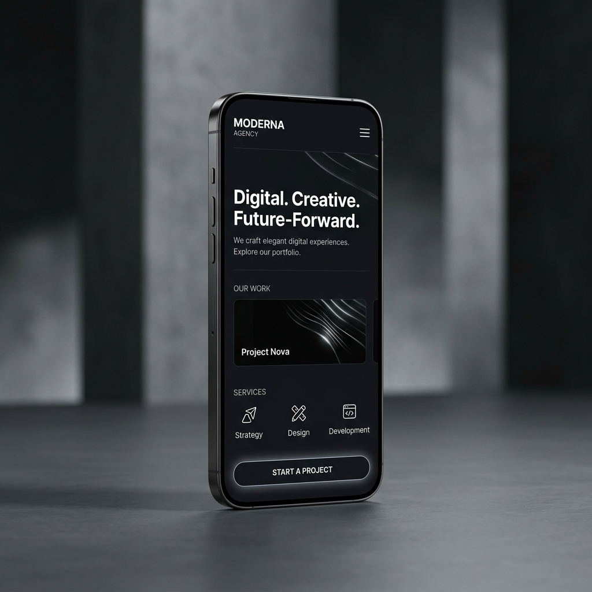

# The Web Branding

A premium, state-of-the-art web branding platform designed with high-end modern aesthetics, dynamic user experiences, and blazing fast raw performance.

---

## 🔗 Live Link
*Live site running at:* [https://web-branding-three.vercel.app/](https://web-branding-three.vercel.app/)

---

## 📸 Screenshots / Demos



---

## 📝 Project Description
The Web Branding is a highly premium digital presence platform representing a web branding agency. It includes high-performance service portfolios, interactive custom estimate tools, and gorgeous UI/UX animations. 

This project operates as a pure, optimized static site (Vanilla HTML/CSS/JS) to achieve maximum 100/100 Lighthouse performance scores and flawless SEO. It bypasses backend complexities by implementing robust serverless API integrations for dynamic features like contact forms.

---

## 🛠️ Tech Stack
*   **Core:** HTML5 (Semantic), CSS3 (Vanilla), JavaScript (ES6+)
*   **Architecture:** Pure Serverless Static Site
*   **APIs:** Web3Forms (for serverless form handling)
*   **Aesthetics:** Glassmorphism, CSS Custom Properties (Theming), Native Easing Micro-Animations
*   **Build/Deployment:** Vercel

---

## ✨ Key Features
*   **Blazing Fast Performance:** Zero framework bloat means near-instant load times globally.
*   **Glassmorphic Design Language:** Premium obsidian themes, glowing background ambient orbs, and clean frosted-glass cards.
*   **Zero-Delay Mobile Menus:** Custom cascading dropdown menus optimized to expand and contract with native easing curves.
*   **Unified Estimation Engine:** Integrated interactive cost slider and project scope calculator.
*   **Serverless Contact Handling:** Seamlessly routes user submissions directly to email via Web3Forms API without requiring a custom backend.

---

## 🚀 Local Setup & Run Instructions

Since this is a lightweight static site, you don't even need Node.js to run it locally! 

```bash
# Clone the repository and navigate to the project directory
git clone https://github.com/favazmk/Web-Branding.git
cd "Web-Branding"

# Option 1: Open directly in your browser
start index.html  # On Windows
open index.html   # On Mac

# Option 2: Run via any simple HTTP server (e.g., Python)
python -m http.server 8000
# Then visit http://localhost:8000
```

---

## 🔒 Security Policy
This project enforces strict security safeguards to prevent credential leakage.
*   **Never** commit `.env` or `.env.*` files containing secret keys, tokens, or API credentials.
*   A pre-configured `.gitignore` handles standard secret file exclusions automatically.
*   Always check `git status` or run verification checks before pushing changes.
